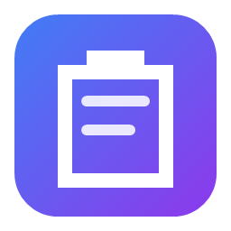
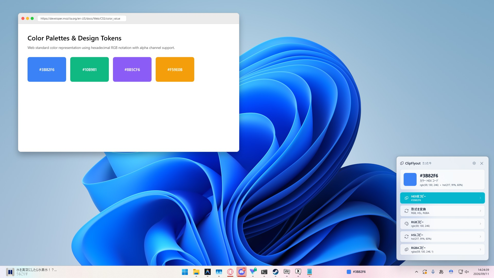

<div align="center">



# ClipFlyout

**Windows 11 Fluent Design に最適化された、クリップボード連携・即時アクションユーティリティ**  
*A modern, privacy-first clipboard utility with native acrylic flyouts and seamless taskbar integration.*

[](https://github.com/featlis/ClipFlyout/releases)
[](LICENSE)
[-0078D4.svg)](https://github.com/featlis/ClipFlyout)
[](https://dotnet.microsoft.com/)

<br />



<br />

[**日本語マニュアル**](#-日本語-マニュアル) • [**English Manual**](#-english-user-manual) • [**開発者ガイド**](#-開発者向けドキュメント-developer-guide)

</div>

---

## 🇯🇵 日本語 マニュアル

### 1. 概要

**ClipFlyout** は、クリップボードにコピーしたテキストや画像の形式をローカルで自動解析し、最適な整形・変換・保存アクションを画面端にすりガラス（アクリル効果）のフライアウトとして提案する Windows 向け常駐ユーティリティです。

作業中のウィンドウからフォーカスを奪わないため、タイピングやブラウジングを中断することなく、1クリックで必要な変換を行えます。また、タスクバー上に最新のコピー内容を小さく表示する **タスクバーウィジェット** も備えています。

---

### 2. 主な特徴

- 🪟 **Windows 11 Fluent Design（本物のアクリル効果）**  
  Windows 11 DWM（デスクトップウィンドウマネージャー）のトランジェントアクリルを採用。美しくなめらかなすりガラス背景と、ダーク / ライトテーマ自動追従に対応しています。
- 📌 **タスクバー直結ウィジェット**  
  最新のコピー内容をタスクバー近傍にシームレスに表示。枠線のない自然なデザインでタスクバーに溶け込み、クリックするだけでいつでもフライアウトを呼び出せます。表示位置プリセットや左右オフセット微調整も可能です。
- ⚡ **1クリック即時アクション & ペースト連携**  
  HEXカラー、Unixタイムスタンプ、JSON、URL、CSV/TSV、Base64 などを自動判別。変換アクション（大文字化・インデント調整など）の実行直後には、次のフライアウトに **「ペースト」** ボタンが自動提示されます。
- 🛡️ **完全ローカル処理・パスワード管理ツール自動除外**  
  外部サーバーへの送信は一切行いません。1Password、Bitwarden、KeePass 等からのコピーは自動検知して除外するため、機密情報が履歴や通知に残る心配がありません。
- 🚀 **初回セットアップウィザード**  
  初回起動時に親しみやすいウェルカム画面が表示され、「既定値で使用する」を1クリックするだけで最適な初期設定で使い始めることができます。
- ⚙️ **PowerToys スタイルの洗練された設定画面**  
  各項目の役割が一目でわかるアイコンプレート付きカードUI。更新確認もポップアップではなく画面内にスマートにインライン表示されます。

---

### 3. 対応データ型とアクション一覧

| データ型 | 検出条件 | 提供される主なアクション |
| :--- | :--- | :--- |
| 🎨 **HEX カラー** | `#RGB`, `#RRGGBB`, `#AARRGGBB` | 色見本プレビュー、RGB / HSL / RGBA 変換コピー |
| ⏱️ **Unix タイムスタンプ** | 10桁 (秒) または 13桁 (ミリ秒) 数値 | ローカル日時文字列、UTC ISO 8601 変換、現在Epochコピー |
| 📦 **JSON テキスト** | JSONオブジェクト `{...}` または配列 `[...]` | インデント整形コピー、1行化 (Minify) コピー |
| 🌐 **Web URL** | `http://` または `https://` リンク | 既定ブラウザで開く、QRコード画像生成コピー、ホストドメインコピー |
| 🧹 **クリーンURL** | UTMトラッカーや `fbclid` を含むリンク | 追跡パラメータを除去したクリーンURLのコピー |
| ✉️ **メールアドレス** | メール形式文字列 | 既定メールアプリ起動、ドメインコピー、ユーザー名コピー |
| 🔒 **Base64 / Data URI** | Base64エンコード文字列、Data URI | プレーンテキストへの復号、画像データとしての直接展開 |
| 📊 **表データ (CSV/TSV)** | Excelやスプレッドシート等の区切りテキスト | Markdownテーブル表への整形、JSON配列への変換 |
| 💻 **コードスニペット** | プログラミング言語構文・インデント | インデント正規化 (スペース2文字)、HTML特殊文字エスケープ |
| 🔤 **識別子ケース変換** | camelCase, snake_case, PascalCase, kebab-case | キャメルケース・スネークケース・ケバブケース相互変換 |
| 🔑 **JWT トークン** | JWT 署名付きトークン | クレームペイロード (JSON) のデコード展開 |
| 🖼️ **クリップボード画像** | スクリーンショットやコピー画像 | 解像度・比率情報の確認、PNGファイルとして直接保存 |
| 📝 **プレーンテキスト** | 上記以外の通常の文字列 | 余分な空白トリム、文字数/単語数/行数カウント、大文字/小文字化 |

---

### 4. インストール方法

#### セットアップインストーラー版（推奨）
1. [GitHub Releases](https://github.com/featlis/ClipFlyout/releases/latest) から `ClipFlyout-Setup-v0.7.0.exe` をダウンロードします。
2. インストーラーを起動します（管理者権限不要のユーザー権限インストールに対応）。
3. インストール完了後、初回セットアップウィザードが立ち上がります。

#### ポータブル版（ZIP）
1. `ClipFlyout-v0.7.0-win-x64.zip` をダウンロードし、任意のフォルダーに解凍します。
2. 解凍フォルダー内の `ClipFlyout.exe` を起動するだけで即座に使用できます（レジストリを汚しません）。

---

### 5. 基本的な使い方

1. **アプリの起動と常駐**  
   起動するとタスクバーの右下（通知領域トレイ）に ClipFlyout のグラデーションアイコンが表示されます。
2. **コピーするだけ**  
   ブラウザやエディタなどでテキストや画像をコピー（`Ctrl + C`）します。
3. **フライアウトからワンクリック実行**  
   画面端に現れるフライアウトカードのボタンをクリックすると、目的の変換や保存が実行されます。
4. **リコールショートカット（再表示）**  
   フライアウトが自動非表示になった後でも、**`Alt + Shift + C`** を押すと直前のフライアウトを再呼び出しできます。
5. **タスクバーウィジェットの活用**  
   タスクバー上に表示されている小さなウィジェットをクリックすることでも、直前のコピー内容のフライアウトを表示できます。右クリックすると位置変更や非表示のコンテキストメニューが開きます。

---

### 6. 設定とカスタマイズ

タスクトレイの ClipFlyout アイコンを右クリックして「**設定**」を選択すると、設定画面（Micaデザイン）が開きます。

- **一般設定**:
  - クリップボード連携の有効/無効
  - タスクバーウィジェットの表示/非表示、配置位置プリセット、左右微調整スライダー (-300px 〜 +300px)
  - パスワードマネージャー除外のオン/オフ
  - リコールショートカット (`Alt+Shift+C`) のオン/オフ
  - Windows ログオン時の自動起動
  - テーマ切り替え（システム準拠 / ライト / ダーク）
  - 言語切り替え（自動 / 日本語 / English）
- **フライアウト動作 & 外観**:
  - 表示位置（右下・右上・左上・左下・カーソル付近）
  - アクリル透明度（20% 〜 100% すりガラス）
  - アクセントカラー（ブルー、パープル、ピンク、グリーン、オレンジ）
  - 自動非表示タイマー（1.5秒 〜 10秒）
  - マウス離脱後の消滅時間（0.5秒 〜 5秒）
- **データ型検出フィルター**:
  - 12種類の検出機能ごとに個別の有効/無効切り替え
- **アプリについて & アップデート**:
  - 設定画面内でワンクリックで最新バージョンの確認・更新インストールが可能（ポップアップなし）

---

### 7. トラブルシューティング

**Q. フライアウトが表示されなくなりました**  
- タスクトレイアイコンを右クリックし、「クリップボード連携」にチェックが入っているか確認してください。
- 1Password や Bitwarden などのパスワード管理ツールからコピーしている場合は、安全のため自動除外されます。

**Q. タスクバーウィジェットの位置を動かしたい**  
- ウィジェットを右クリックするか、設定画面の「ウィジェットの表示位置」から「タスクバー右」「中央・右寄り」「中央・左寄り」「左端」「画面右下直上」を選べます。さらに「左右微調整」スライダーで数ピクセル単位の微調整も可能です。誤操作を防ぐためドラッグ移動ではなく安定したプリセット＋スライダー方式を採用しています。

**Q. 背景のアクリル効果（すりガラス）が効かない**  
- Windows の「設定」>「アクセシビリティ」または「個人用設定」>「色」で「**透明効果**」がオンになっていることを確認してください。省電力モード時やリモートデスクトップ接続時は Windows 側でアクリル効果が無効化される場合があります。

---

## 🇺🇸 English User Manual

### 1. Overview

**ClipFlyout** is a resident Windows utility that runs silently in the background, analyzing whatever you copy and presenting relevant formatting, conversion, and quick actions via a sleek, non-activating acrylic flyout.

With zero loss of window focus, you can convert timestamps, format JSON, preview colors, or copy cleaned URLs with a single click.

---

### 2. Key Features

- **True Windows 11 Acrylic Glass**: Real-time DWM-rendered transient acrylic blur effect with dark and light theme support.
- **Docked Taskbar Widget**: Minimal, borderless widget placed directly near your taskbar showing the active snippet with position preset options and fine-tuning slider.
- **1-Click Actions & Auto-Paste**: Primary actions styled with your preferred accent color, plus instant "Paste" suggestion after transform operations.
- **Privacy First & Local**: 100% local processing. Automatically ignores clipboard copies from password managers (1Password, Bitwarden, KeePass).
- **Initial Setup Wizard**: First-run welcome guide with a quick "Use Defaults" button.
- **PowerToys-Inspired Settings**: Organized card interface with inline update check (no disruptive alert boxes).

---

### 3. Supported Types & Actions

| Data Type | Detection Condition | Quick Actions |
| :--- | :--- | :--- |
| **HEX Color** | `#RGB`, `#RRGGBB`, `#AARRGGBB` | Swatch preview, Copy RGB, HSL, RGBA |
| **Unix Timestamp** | 10-digit (s) or 13-digit (ms) epochs | Local date string, ISO 8601, Current epoch |
| **JSON** | `{...}` objects or `[...]` arrays | Indented prettify, Minify |
| **Web URL** | `http://` or `https://` | Open in browser, Generate QR image, Copy domain |
| **Clean URL** | Tracking parameters (`utm_*`, `fbclid`) | Strip trackers and copy clean URL |
| **Email** | Valid email format | Compose email, Copy domain, Copy user |
| **Base64** | Base64 string / Data URI | Decode to plain text, Unpack image to clipboard |
| **Tables (CSV/TSV)**| Tab or comma delimited tabular data | Format to Markdown table, Convert to JSON array |
| **Code** | Programming snippets | Normalize indent to 2 spaces, Escape HTML entities |
| **Case Converter** | camelCase, snake_case, PascalCase, kebab-case | Convert between popular naming conventions |
| **JWT Token** | JSON Web Tokens | Decode and view claims JSON |
| **Image** | Image in clipboard | View dimensions & aspect ratio, Save PNG to file |
| **Plain Text** | Other regular text strings | Trim whitespace, Character/word count, UPPER/lower |

---

### 4. Installation & Usage

1. Download `ClipFlyout-Setup-v0.7.0.exe` or portable `ClipFlyout-v0.7.0-win-x64.zip` from [GitHub Releases](https://github.com/featlis/ClipFlyout/releases/latest).
2. Copy any supported content with `Ctrl + C`.
3. The acrylic flyout appears smoothly at the screen corner without stealing your typing focus.
4. Press **`Alt + Shift + C`** anytime to recall the last hidden flyout.

---

## 🛠️ 開発者向けドキュメント (Developer Guide)

### 開発要件 (Prerequisites)

- Windows 10 / 11 (x64)
- [.NET 9.0 SDK](https://dotnet.microsoft.com/download/dotnet/9.0)
- [Inno Setup 6](https://jrsoftware.org/isdl.php) (インストーラーパッケージ生成時のみ)

### ビルドと単体テスト (Build & Tests)

```powershell
# ソリューションのビルド
dotnet build ClipFlyout.csproj -c Release

# 単体テストの実行 (68件のテストスイート)
dotnet test tests/ClipFlyout.Tests/ClipFlyout.Tests.csproj -c Release
```

### 配布パッケージの作成 (Build Installer & Portable ZIP)

```powershell
# バージョンを指定してインストーラーとZIPを生成
powershell -ExecutionPolicy Bypass -File scripts\build-installer.ps1 -Version 0.7.0
```
実行後、`dist/` ディレクトリに以下のファイルが出力されます：
- `dist/ClipFlyout-Setup-v0.7.0.exe` (自己解凍・Inno Setup インストーラー)
- `dist/ClipFlyout-v0.7.0-win-x64.zip` (単一実行可能ファイル形式のポータブル版)
- `dist/checksums-sha256.txt` (配布用 SHA-256 チェックサム一覧)

### アーキテクチャ概要 (Architecture)

- **`Services/ClipboardMonitor.cs`**: `AddClipboardFormatListener` (Win32 API) によるイベント駆動監視。自己書き込みループを防止するシーケンス番号検証と、他プロセス競合時の非同期5回リトライ機構を実装。
- **`Services/DataTypeDetector.cs`**: 優先度順の正規表現および構文解析エンジン。1MB以上の巨大ペイロードに対する安全な保護リミットを内包。
- **`Services/FlyoutWindowManager.cs`**: `WS_EX_NOACTIVATE` 属性による非アクティブウィンドウ制御、Per-Monitor DPI 対応の正確な画面端吸着配置。
- **`Services/AppIconHelper.cs`**: 16px〜256pxのマルチ解像度対応ベクターレンダラー。GDI+ / WPF 双方へ高品質アイコンを提供。
- **`Views/TaskbarWidgetWindow.xaml.cs`**: タスクバー上に直接オーバーレイし、最新のコピー内容（実テキスト・画像解像度等）をシームレスに常時表示する最前面ウィジェット。
- **`Views/SettingsWindow.xaml`**: 5つの明瞭なタブ（全般、外観、フィルター、更新、クレジット）と、RGBスライダー連動の本格的カラーピッカー。
- **`Controls/ToggleSwitch.xaml.cs`**: WinUI 3 準拠のフルイドストレッチアニメーション付きトグルスイッチ。

---

## 📜 ライセンス & クレジット (License & Credits)

- **プロジェクト**: ClipFlyout Project
- **開発・著作**: [featlis](https://github.com/featlis) and contributors
- **ライセンス**: [GNU General Public License version 3 (GPL-3.0-or-later)](LICENSE)

本ソフトウェアは自由ソフトウェアです。フリーソフトウェア財団が公表した GNU General Public License version 3 (GPL-3.0-or-later) の条項に基づき、どなたでも無償で自由に使用、研究、改変、再配布することができます。
